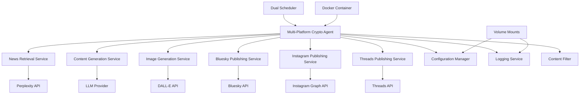

# Design Document

## Overview

The Multi-Platform Crypto Agent is a containerized AI-powered content creation system that automatically generates and posts cryptocurrency content to Bluesky, Instagram, and Threads. The system follows a dual-schedule workflow: creating viral/engaging content for Bluesky and Threads every 30 minutes, and generating educational content with custom images for Instagram every 6 hours.

The architecture leverages the existing LangChain agent framework, extending the BaseAgent class with specialized tools for news retrieval, platform-specific content generation, image generation, and multi-platform social media posting.

## Architecture

### High-Level Architecture



### Component Architecture

The system extends the existing BaseAgent architecture with specialized components:

- **BlueskyCryptoAgent**: Main orchestrator extending BaseAgent
- **NewsRetrievalTool**: LangChain tool for Perplexity API integration
- **ContentGenerationTool**: AI-powered content creation and optimization
- **BlueskySocialTool**: Bluesky API integration for posting
- **InstagramSocialTool**: Instagram Graph API integration for posting with images
- **ThreadsSocialTool**: Threads API integration for posting
- **ImageGenerationTool**: DALL-E API integration for Instagram image creation
- **ContentFilter**: Quality and duplication prevention
- **SchedulerService**: Dual scheduling for different platform frequencies

## Components and Interfaces

### 1. BlueskyCryptoAgent (Core Agent)

```python
class BlueskyCryptoAgent(BaseAgent):
    def __init__(self, llm, config):
        super().__init__(llm)
        self.config = config
        self.content_history = []
        
    async def execute_workflow(self):
        # Main workflow: retrieve -> generate -> filter -> post
        pass
```

**Responsibilities:**
- Orchestrate the complete workflow
- Manage tool execution and error handling
- Maintain content history for duplication prevention
- Handle scheduling integration

### 2. NewsRetrievalTool

```python
class NewsRetrievalTool(Tool):
    name = "crypto_news_retrieval"
    description = "Retrieves latest cryptocurrency news from Perplexity API"
    
    def _run(self, query: str) -> dict:
        # Perplexity API integration
        pass
```

**Interface:**
- Input: Search query/topics (Bitcoin, Ethereum, DeFi, etc.)
- Output: Structured news data with headlines, summaries, sources
- Error handling: Retry logic with exponential backoff
- Rate limiting: Respect API limits

### 3. ContentGenerationTool

```python
class ContentGenerationTool(Tool):
    name = "viral_content_generator"
    description = "Generates engaging social media content from news"
    
    def _run(self, news_data: dict) -> str:
        # AI-powered content generation
        pass
```

**Interface:**
- Input: Raw news data and context
- Output: Optimized social media post (≤300 chars)
- Features: Viral hooks, hashtags, engagement optimization
- Content strategies: Controversy, insights, trending topics

### 4. BlueskySocialTool

```python
class BlueskySocialTool(Tool):
    name = "bluesky_publisher"
    description = "Posts content to Bluesky social platform"
    
    def _run(self, content: str) -> dict:
        # Bluesky API integration
        pass
```

**Interface:**
- Input: Generated content and metadata
- Output: Post confirmation and metrics
- Authentication: AT Protocol integration
- Error handling: Retry logic for failed posts

### 5. InstagramSocialTool

```python
class InstagramSocialTool(Tool):
    name = "instagram_publisher"
    description = "Posts educational content with images to Instagram"
    
    def _run(self, content: str, image_url: str) -> dict:
        # Instagram Graph API integration
        pass
```

**Interface:**
- Input: Educational content and generated image URL
- Output: Post confirmation with media ID
- Authentication: Instagram Graph API with business account
- Features: Image upload, caption posting, hashtag optimization
- Error handling: Retry logic for failed uploads

### 6. ThreadsSocialTool

```python
class ThreadsSocialTool(Tool):
    name = "threads_publisher"
    description = "Posts content to Threads social platform"
    
    def _run(self, content: str) -> dict:
        # Threads API integration
        pass
```

**Interface:**
- Input: Generated content and metadata
- Output: Post confirmation and post ID
- Authentication: Threads API integration
- Error handling: Retry logic for failed posts

### 7. ImageGenerationTool

```python
class ImageGenerationTool(Tool):
    name = "image_generator"
    description = "Generates educational crypto images using DALL-E"
    
    def _run(self, prompt: str) -> str:
        # DALL-E API integration
        pass
```

**Interface:**
- Input: Educational content description and visual prompt
- Output: Generated image URL
- Features: Crypto-themed educational visuals
- Error handling: Fallback to template images on failure

### 5. ContentFilter

```python
class ContentFilter:
    def __init__(self, history_size=50):
        self.recent_posts = deque(maxlen=history_size)
        
    def is_duplicate(self, content: str) -> bool:
        # Similarity checking logic
        pass
        
    def quality_check(self, content: str) -> bool:
        # Content quality validation
        pass
```

**Responsibilities:**
- Prevent duplicate content posting
- Quality assurance checks
- Content moderation and filtering
- Maintain posting history

### 6. SchedulerService

```python
class SchedulerService:
    def __init__(self, agent: BlueskyCryptoAgent):
        self.agent = agent
        self.schedule = schedule
        
    def start(self):
        # Schedule every 30 minutes
        self.schedule.every(30).minutes.do(self.run_workflow)
```

**Features:**
- Cron-like scheduling (every 30 minutes)
- Error recovery and continuation
- Timeout handling (25-minute limit)
- Graceful shutdown handling

## Data Models

### NewsItem

```python
@dataclass
class NewsItem:
    headline: str
    summary: str
    source: str
    timestamp: datetime
    relevance_score: float
    topics: List[str]
    url: Optional[str]
```

### GeneratedContent

```python
@dataclass
class GeneratedContent:
    text: str
    hashtags: List[str]
    engagement_score: float
    content_type: str  # "news", "analysis", "opinion"
    source_news: NewsItem
    created_at: datetime
```

### PostResult

```python
@dataclass
class PostResult:
    success: bool
    post_id: Optional[str]
    timestamp: datetime
    content: GeneratedContent
    error_message: Optional[str]
    retry_count: int
```

### Configuration

```python
@dataclass
class AgentConfig:
    # API Configuration
    perplexity_api_key: str
    openai_api_key: str  # For DALL-E image generation
    bluesky_username: str
    bluesky_password: str
    instagram_access_token: str
    instagram_business_account_id: str
    threads_access_token: str
    
    # Scheduling
    posting_interval_minutes: int = 30  # For Bluesky and Threads
    instagram_posting_interval_hours: int = 6  # For Instagram
    max_execution_time_minutes: int = 25
    
    # Content Settings
    bluesky_max_length: int = 300
    threads_max_length: int = 500
    instagram_max_length: int = 2200
    content_themes: List[str] = field(default_factory=lambda: ["Bitcoin", "Ethereum", "DeFi"])
    
    # Quality Control
    min_engagement_score: float = 0.7
    duplicate_threshold: float = 0.8
    max_retries: int = 3
```

## Error Handling

### API Error Handling

1. **Perplexity API Failures:**
   - Retry up to 3 times with exponential backoff (1s, 2s, 4s)
   - Log failures and continue with cached content if available
   - Rate limit handling with appropriate delays

2. **Bluesky API Failures:**
   - Retry up to 2 times for posting failures
   - Authentication error handling with credential refresh
   - Network timeout handling

3. **Content Generation Failures:**
   - Fallback to simpler content templates
   - Skip posting cycle if content quality is too low
   - Log generation failures for monitoring

### System Error Handling

1. **Docker Container Issues:**
   - Automatic restart policies
   - Health checks and monitoring
   - Persistent logging outside container

2. **Scheduling Failures:**
   - Continue with next scheduled run on errors
   - Timeout handling for long-running operations
   - Graceful shutdown on system signals

## Testing Strategy

### Unit Testing

1. **Tool Testing:**
   - Mock API responses for Perplexity and Bluesky
   - Test error handling and retry logic
   - Validate content generation quality

2. **Component Testing:**
   - Content filter accuracy testing
   - Configuration validation
   - Scheduler reliability testing

### Integration Testing

1. **API Integration:**
   - End-to-end testing with real APIs (staging)
   - Authentication flow testing
   - Rate limiting behavior validation

2. **Workflow Testing:**
   - Complete workflow execution testing
   - Error recovery testing
   - Performance testing under load

### System Testing

1. **Docker Testing:**
   - Container build and deployment testing
   - Volume mounting and persistence testing
   - Environment variable configuration testing

2. **Monitoring Testing:**
   - Log aggregation and analysis
   - Alert system testing
   - Performance metrics collection

### Content Quality Testing

1. **Content Validation:**
   - Engagement prediction accuracy
   - Duplicate detection effectiveness
   - Content appropriateness checking

2. **A/B Testing Framework:**
   - Multiple content generation strategies
   - Performance comparison metrics
   - Automated optimization based on results